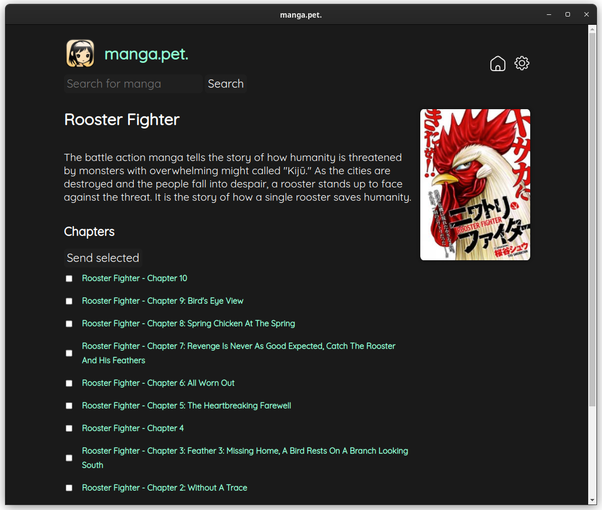

# manga.pet.

An application to download, convert and send manga to your kindle. It is my own replacement for kmanga.net, which has been taken down.

## What does it do
* scrapes KissManga.org to find the manga you want
* downloads the images and converts them to an epub
* sends the epub via email to your kindle
  
All with just a few clicks.

## Notes on usage
Before you start using manga.pet. you should:
* set up your gmail credentials in the settings
  * you will have to create an app password for your gmail [guide](https://support.google.com/accounts/answer/185833?hl=en)
* whitelist your gmail address in your amazon account [guide](https://www.amazon.com/gp/help/customer/display.html?nodeId=GX9XLEVV8G4DB28H).
  * otherwise your kindle won't accept the email

